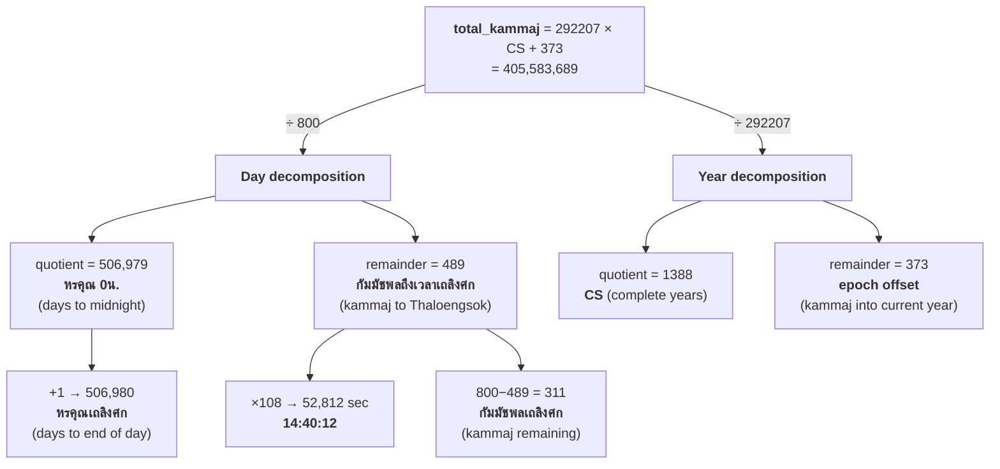
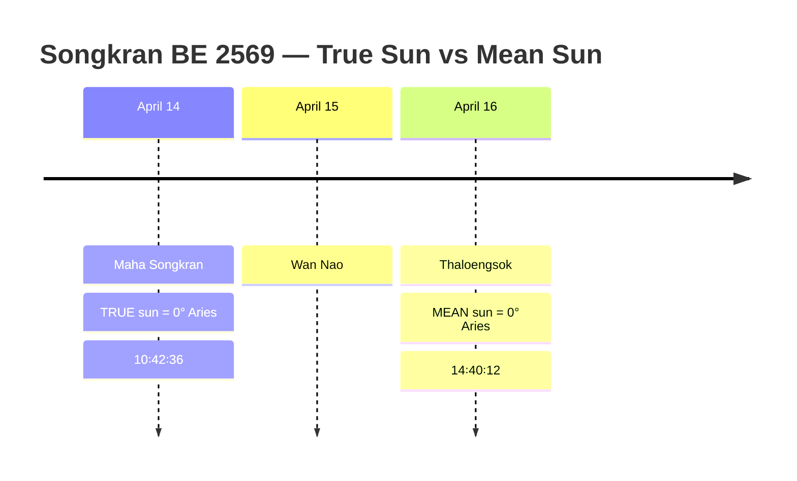
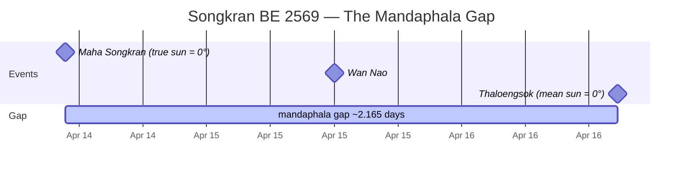
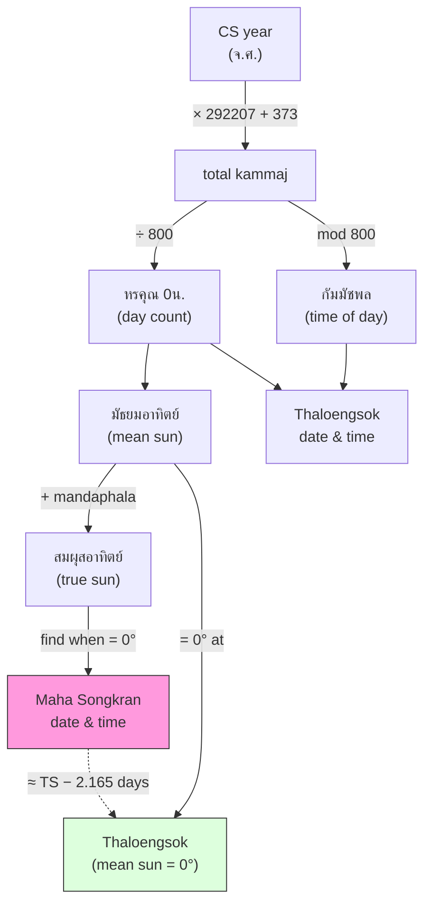

# Diagram Exploration: ASCII vs Mermaid

Testing which format works best for each diagram type.

---

## Diagram 1: Kammaj Decomposition Tree

### Mermaid (flowchart — natural fit)



### ASCII

```
   total_kammaj = 292207 × CS + 373 = 405,583,689
          │
          ├── ÷ 292207 ──┬── quotient = 1388 (= CS, complete years)
          │               └── remainder = 373 (epoch offset)
          │
          └── ÷ 800 ─────┬── quotient = 506,979 (หรคุณ 0น.)
                          │    └── +1 = 506,980 (หรคุณเถลิงศก)
                          │
                          └── remainder = 489 (กัมมัชพลถึงเวลาเถลิงศก)
                               ├── × 108 = 52,812 sec = 14:40:12
                               └── 800 - 489 = 311 (กัมมัชพลเถลิงศก)
```

**Verdict**: Mermaid wins — the tree structure is its sweet spot.

---

## Diagram 2: Songkran Three-Day Window

### Mermaid (timeline)



### Mermaid (gantt — shows the gap visually)



### ASCII

```
     April 14          April 15          April 16
 ────────┼─────────────────┼─────────────────┼──────────
         │                 │                 │
  TRUE sun = 0°            │          MEAN sun = 0°
  ▼ Maha Songkran          │          ▼ Thaloengsok
  10:42:36                  │          14:40:12
         │                 │                 │
         │    Wan Nao      │                 │
         │                                   │
         ├───── mandaphala gap ≈ 2.165 days ─┤
               (1732 kammaj)
```

**Verdict**: ASCII wins — the precise positioning and annotations (arrows,
gap markers) communicate better than Mermaid's timeline/gantt here.

---

## Diagram 3: Day-Level Number Line

### Mermaid (gantt)

```mermaid
gantt
    title Thaloengsok Day — April 16, 2026
    dateFormat HH:mm:ss
    axisFormat %H:%M

    section Time spans
    489 kammaj to Thaloengsok  :active, a1, 00:00:00, 14h40min12s
    311 kammaj remaining       :a2, 14:40:12, 9h19min48s

    section Markers
    midnight (หรคุณ 0น.)       :milestone, m1, 00:00:00, 0d
    Thaloengsok moment         :milestone, m2, 14:40:12, 0d
    midnight (หรคุณ)           :milestone, m3, 23:59:59, 0d
```



### ASCII

```
  midnight                    Thaloengsok              midnight
  0h                          14:40:12                 24h
  ├───────── 489 kammaj ──────┤────── 311 kammaj ──────┤
  │     (remainder from ÷800) │  (800 − remainder)     │
  │                           │                         │
  │←── หรคุณ 0น. = 506,979 ──│                         │
  │←──────── หรคุณ = 506,980 ─────────────────────────→│
  │                           │
  │                    mean sun = 0°
```

**Verdict**: ASCII wins — the double-ended annotations (หรคุณ 0น. vs หรคุณ)
and the mean sun marker need precise positioning that Gantt can't express.

---

## Diagram 4: Zodiac / Angular View

### Mermaid

No circular layout available. A flowchart can show relationships but not geometry:


### ASCII

```
                      0° Aries ← TRUE sun here
                         │
                  ╭──────┼──────╮
             330°╱  mean ↗│      ╲30°
            ╱    sun     │           ╲
       300°│    ~358°    │            │60°
           │         +131 lipda       │
  270° ────┤      (mandaphala)        ├── 90°
           │             │            │
       240°│             │  ☉ 80°     │120°
            ╲            │ apogee    ╱
             210°╲       │     ╱150°
                  ╰──────┼──────╯
                        180°
```

**Verdict**: ASCII wins decisively — Mermaid simply cannot do circular layouts.

---

## Diagram 5: Concept Relationship Map

### Mermaid (flowchart — this is where Mermaid shines)



### ASCII

```
  CS year ──→ × 292207 + 373 ──→ total_kammaj
                                     │
                          ┌──────────┼──────────┐
                          ÷ 800               mod 800
                          ↓                     ↓
                     หรคุณ 0น.             กัมมัชพล
                     (day count)         (time of day)
                          │                     │
                          ↓                     │
                   มัธยมอาทิตย์ ──────────────→ Thaloengsok
                   (mean sun)              date & time
                          │
                    + mandaphala
                          ↓
                   สมผุสอาทิตย์
                    (true sun)
                          │
                  find when = 0°
                          ↓
                   Maha Songkran ·····≈ TS − 2.165 days
```

**Verdict**: Mermaid wins — the styled nodes and labeled edges are clearer.

---

## Summary

| Diagram | Best Format | Why |
|---|---|---|
| Kammaj decomposition tree | **Mermaid** | Tree structure is Mermaid's strength |
| Songkran 3-day window | **ASCII** | Needs precise timeline annotations |
| Day-level number line | **ASCII** | Double-ended ranges, precise markers |
| Zodiac circle | **ASCII** | Mermaid has no circular layout |
| Concept relationship map | **Mermaid** | Labeled edges and styled nodes |
