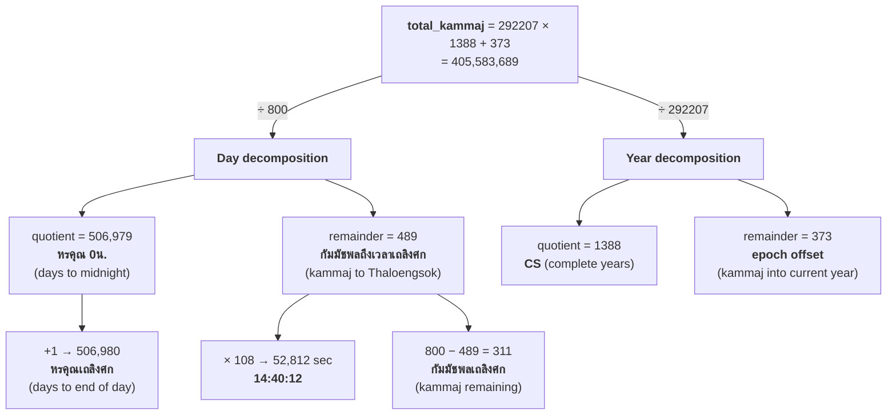
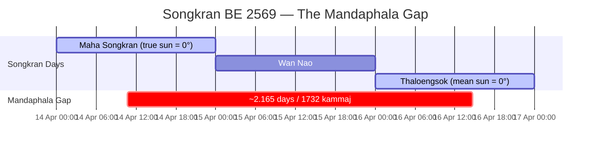

# Suriya Yatra Songkran Calculation — Research Notes

Research on calculating Songkran dates according to the Suriya Yatra
(สุริยยาตร์) calendar system. Structure follows the teaching progression
in the reference textbook (see References).

## 1. Overview

The **Suriya Yatra** (คัมภีร์สุริยยาตร์) is a Thai astronomical treatise derived
from the Indian Surya Siddhanta tradition. It provides the mathematical
framework for computing planetary positions and calendar dates. The method was
refined and modernized by อาจารย์ พลตรี บุนนาค ทองเนียม, who adapted the
traditional calculation for use with modern arithmetic (originally published
BE 2519/1976 CE).

### The Three Songkran Days

| Day | Thai | Astronomical Definition |
|---|---|---|
| Maha Songkran | วันมหาสงกรานต์ | **True sun** (สมผุสอาทิตย์) enters Aries |
| Wan Nao | วันเนา | Day between Maha Songkran and Thaloengsok |
| Thaloengsok | วันเถลิงศก | **Mean sun** (มัธยมอาทิตย์) enters Aries; new Chula Sakarat year |

The critical distinction: Thaloengsok is defined by the **mean** (uniform-speed)
sun, while Maha Songkran is defined by the **true** (actual-speed) sun. The
difference between mean and true sun — the **mandaphala** (มันทผล, equation of
center) — creates the ~2-day gap between the two events.

The modern Thai calendar fixes Songkran at April 13-15, but the dates computed
by the Suriya Yatra are typically **April 14-16** (with exceptions such as
BE 2551 and BE 2555 where it falls on April 13-15).

## 2. Units and Definitions

### Time / Angular Unit: Kammajaphon (กัมมัชพล)

The kammajaphon has a **dual nature** — it measures both time and angular
position of the sun. Because the mean sun moves at a uniform rate, the two
are directly proportional.

| As time | As angle |
|---|---|
| 1 kammajaphon = 108 seconds | 1 day of solar motion ≈ 59.1361 lipda |
| 800 kammajaphon = 1 day | 292,207 kammajaphon = 1 full revolution |
| 292,207 kammajaphon = 1 sidereal year | 1 year = 365.258750 days |

### Angular Units

| Unit | Thai | Value |
|---|---|---|
| 1 circle | 1 รอบ | 360° = 12 rasi = 21,600 lipda |
| 1 rasi | 1 ราศี | 30° = 1,800 lipda |
| 1 degree | 1 องศา | 60 lipda |
| 1 lipda | 1 ลิปดา | 60 pilipda (arc-minutes) |
| 1 pilipda | 1 วิลิปดา | arc-seconds |
| 1 khan | 1 ขันธ์ | 15° = 900 lipda (1/6 of a quadrant) |

### Key Terms

**Calendar and time:**

- **CS** (จ.ศ., Chula Sakarat): Thai minor era year. CS = BE - 1181 = CE - 638.
- **หรคุณ** (horakhun): Cumulative day count from CS 0 epoch to end of target
  day (24h).
- **หรคุณ 0 น.** (horakhun 0h): Day count to start of target day (0h).
  หรคุณ = หรคุณ 0น. + 1.
- **วันเถลิงศก** (Thaloengsok): Day the **mean sun** enters 0° Aries; new CS year.
- **วันมหาสงกรานต์** (Maha Songkran): Day the **true sun** enters 0° Aries;
  ~2.165 days before Thaloengsok.

**Astronomical:**

- **มัธยม** (matthayom): Mean position — computed assuming uniform speed.
- **สมผุส** (samaphut): True position — corrected for actual non-uniform speed.
- **มันทผล** (mandaphala): Equation of center — the correction from mean to
  true position.
- **ภุช** (bhuja) and **โกฏิ** (koti): Sine and cosine components when reducing
  an angle to the first quadrant (0-90°).
- **ฉายาเท่าขันธ์**: Correction values tabulated at each khan (15°) boundary.
- **ทอนรอบ / ทอน** (thon): Modular reduction — keep angles within 0-21,600
  lipda (one full circle).

### Reference Meridian

The Suriya Yatra uses **Ujjain** (อุชเชนี), India as its reference meridian,
following the original Indian astronomical tradition.

## 3. Epoch

| Property | Value |
|---|---|
| Epoch event | Thaloengsok of Chula Sakarat 0 (จ.ศ. 0) |
| Gregorian date | Sunday, 25 March 638 CE (proleptic) |
| Buddhist Era | BE 1181 (พ.ศ. 1181) |
| Julian Day at midnight | 1,954,167.5 |
| Mean sun at epoch Thaloengsok | 0 rasi 0° 0 lipda (= 0° Aries at Ujjain) |
| Time of Thaloengsok | 11:11:24 = 373 kammajaphon from midnight |

Year conversion:

```
CS (จ.ศ.) = BE - 1181 = CE - 638
```

At the epoch, the mean sun is at exactly 0° Aries by definition. Each
subsequent year, the mean sun returns to 0° at the Thaloengsok moment, offset
by the accumulated fractional kammajaphon.

## 4. Thaloengsok: When the Mean Sun Enters Aries

Thaloengsok (วันเถลิงศก) is the day the Chula Sakarat year changes.
It corresponds to the moment the **mean sun** (มัธยมอาทิตย์) crosses 0° Aries
— i.e., when the mean sun's longitude equals 0 rasi 0° 0 lipda at Ujjain.

### 4.1 The Core Formula

```
total_kammaj = 292207 × CS + 373
```

Divide by 800:

```
total_kammaj / 800 = quotient ... remainder
```

This gives two values:

| Value | Name | Thai | Meaning |
|---|---|---|---|
| quotient | Horakhun 0h | หรคุณ 0 น. | Days from epoch to Thaloengsok day **midnight** |
| quotient + 1 | Horakhun | หรคุณเถลิงศก | Days from epoch to Thaloengsok day **end** (24h) |
| remainder | Kammaj to Thaloengsok | กัมมัชพลถึงเวลาเถลิงศก | Kammaj from midnight to the Thaloengsok moment |
| 800 - remainder | Kammajaphon Thaloengsok | กัมมัชพลเถลิงศก | Kammaj remaining until end of day |

Note: the traditional texts (e.g., Wikipedia) define กัมมัชพลเถลิงศก as
`800 - remainder` (time remaining). The reference textbook uses the remainder
directly as กัมมัชพลถึงเวลาเถลิงศก (time to Thaloengsok). Both are valid.

### 4.2 Additional Atta Thaloengsok Values

Beyond the date, the Suriya Yatra computes these values at each Thaloengsok
for use in the lunisolar calendar:

```
masaken  = floor((703 × horakhun + 650) / (692 × 30))    # lunar months elapsed
tithi    = floor(((703 × horakhun + 650) / 692) - 30 × masaken)  # lunar day (0-29)
avoman   = (703 × horakhun + 650) mod 692                 # lunar excess
uccapon  = (horakhun + 2611) mod 3232                      # moon apogee position
war      = horakhun mod 7                                  # weekday (1=Sun ... 0=Sat)
```

These determine intercalary months (อธิกมาส) and intercalary days (อธิกวาร)
in the Thai lunisolar calendar.

### 4.3 Worked Example: BE 2569 (CE 2026)

```
CS = 2569 - 1181 = 1388

total_kammaj = 292207 × 1388 + 373 = 405,583,689
405,583,689 / 800 = 506,979 remainder 489

หรคุณ 0 น.              = 506,979 days
หรคุณเถลิงศก             = 506,980 days
กัมมัชพลถึงเวลาเถลิงศก   = 489 kammaj
กัมมัชพลเถลิงศก           = 311 kammaj

Time of Thaloengsok = 489 × 108 = 52,812 sec = 14:40:12
```

**Result: Thaloengsok = April 16, 2026 at 14:40:12**



## 5. Mean Sun (มัธยมอาทิตย์)

The **mean sun** is the sun's position assuming it orbits at a perfectly uniform
speed. At Thaloengsok, the mean sun is at 0° Aries by definition. For any
other date/time, the mean sun position can be computed.

### 5.1 General Formula

From the reference textbook (Ch. 4, p. 53):

```
                    หรคุณ 0น.วันประสงค์ × 800 + INT(เวลาประสงค์ × 800 / 24) - 373
mean_sun_calc =  ─────────────────────────────────────────────────────────────────
                                            292207
```

The **remainder** from this division (in kammajaphon) gives the mean sun's
position within its current revolution. To convert to lipda:

```
mean_sun_lipda = remainder × 21600 / 292207
```

Or equivalently, at a rate of approximately **59.1361 lipda per day**.

### 5.2 At Thaloengsok

At the Thaloengsok moment, the mean sun = 0° by definition. The formula
confirms this: the total kammaj from epoch is exactly divisible by the year
length (292,207), with the 373-kammaj epoch offset accounting for the
sub-day timing.

## 6. True Sun (สมผุสอาทิตย์)

The **true sun** (สมผุสอาทิตย์) is the sun's actual position, accounting for
its non-uniform apparent motion. The sun appears to move faster near perigee
and slower near apogee.

### 6.1 The Mandaphala Correction (มันทผล)

The correction from mean to true sun is called **รวิชภูชผล** (rawicha
bhuchaphon) or mandaphala. It depends on the mean sun's angular distance
from the sun's apogee (อุจจ์อาทิตย์).

**Sun's apogee**: Fixed at **80°** (4,800 lipda) in the Suriya Yatra.

### 6.2 Procedure

1. **Compute the kendra** (mean anomaly):
   ```
   kendra = mean_sun - 4800    (mod 21600, i.e., ทอนรอบ)
   ```

2. **Reduce to bhuja** (ภุช) — first quadrant equivalent:
   - Quadrant 1 (0-5400 lipda): bhuja = kendra
   - Quadrant 2 (5400-10800): bhuja = 10800 - kendra
   - Quadrant 3 (10800-16200): bhuja = kendra - 10800
   - Quadrant 4 (16200-21600): bhuja = 21600 - kendra

3. **Look up ฉายาเท่าขันธ์** (mandaphala table) at each khan boundary,
   interpolate for intermediate values:

   | Khan | Bhuja | ฉายาเท่าขันธ์ (lipda) |
   |---|---|---|
   | 0 | 0° | 0 |
   | 1 | 15° | 35 |
   | 2 | 30° | 67 |
   | 3 | 45° | 94 |
   | 4 | 60° | 116 |
   | 5 | 75° | 129 |
   | 6 | 90° | 134 |

   The maximum correction is **134 lipda ≈ 2.23°**.

4. **Apply the sign** based on the kendra's half:
   - Kendra 0-10800 (0°-180°): **subtract** mandaphala from mean sun
   - Kendra 10800-21600 (180°-360°): **add** mandaphala to mean sun

5. **True sun**:
   ```
   true_sun = mean_sun ± mandaphala    (ทอนรอบ to keep within 0-21600)
   ```

### 6.3 Interpretation

When the mean sun is in the slow half of its orbit (past apogee, heading to
perigee), the true sun lags behind — so the mandaphala is subtracted. When
the mean sun is in the fast half (past perigee, heading to apogee), the true
sun is ahead — so the mandaphala is added.

## 7. Maha Songkran: When the True Sun Enters Aries

**Maha Songkran** (วันมหาสงกรานต์) is the day the **true sun** crosses 0° Aries.
Because the true sun leads the mean sun near the Aries point (kendra ≈ 280°,
in the "fast" half), the true sun enters Aries **before** the mean sun does.
This is why Maha Songkran precedes Thaloengsok by about 2 days.

### 7.1 The ~2.165-Day Gap

At the Aries ingress point:
- Mean sun ≈ 358° (approaching 0°)
- Kendra ≈ 278° (in the add-mandaphala zone)
- Bhuja ≈ 82°
- Mandaphala ≈ 131 lipda ≈ 2.18°

The true sun reaches 0° when the mean sun is still at ~358° — about **2.165
days** before the mean sun itself reaches 0° (Thaloengsok). This is the
origin of the 1,732-kammaj offset.

```
                      0° Aries ← TRUE sun arrives here first
                         │
                  ╭──────┼──────╮
             330°╱  mean ↗│      ╲30°
            ╱    sun     │           ╲
       300°│    ~358°    │            │60°
           │         +131 lipda       │
  270° ────┤      (mandaphala)        ├── 90°
           │             │            │
       240°│             │  ☉ 80°     │120°
            ╲            │ apogee    ╱
             210°╲       │     ╱150°
                  ╰──────┼──────╯
                        180°
```

### 7.2 Approximate Formula (Fixed Offset)

The offset is approximated as a constant:

```
offset = 1732 kammajaphon = 2 days 3 hours 57 minutes 36 seconds = 2.165 days
```

Three equivalent expressions:

```
# Kammaj formula
total_kammaj_ms = 292207 × CS - 1359

# JD formula
JD_songkran = floor((292207 × CS - 1359) / 800) + 1954167.5

# Gregorian formula
MS = VT - 2.165
```

The constant -1359 = 373 (epoch offset) - 1732 (Maha Songkran offset).



*(Values shown for BE 2569)*

### 7.3 Worked Example: BE 2569

```
MS = 16.61125 - 2.165 = 14.44625
   → April 14, 10:42:36

Equivalently:
  total_kammaj = 292207 × 1388 - 1359 = 405,581,957
  405,581,957 / 800 = 506,977 remainder 357
  time = 357 × 108 = 38,556 sec = 10:42:36
```

Wan Nao = April 15, 2026 (the day between).

**Maha Songkran day composition** (April 14, 2026):


หรคุณ 0น. = 506,977 (epoch → 0h) | หรคุณ = 506,978 (epoch → 24h)

**Thaloengsok day composition** (April 16, 2026):


หรคุณ 0น. = 506,979 (epoch → 0h) | หรคุณ = 506,980 (epoch → 24h)

### 7.4 Precision Limitations

The approximate formula uses a **fixed** 1732-kammaj offset. In reality, the
mandaphala at the Aries ingress varies slightly from year to year because the
mean sun's position relative to the apogee shifts with each year's fractional
kammaj accumulation. The fixed offset is therefore an approximation.

Additionally, the formula produces times quantized to the **108-second kammaj
grid** (every result is an integer kammaj × 108 seconds):

```
Nearest grid points around the Maha Songkran time:
  356 kammaj = 38,448 sec = 10:40:48
  357 kammaj = 38,556 sec = 10:42:36  ← formula result
  358 kammaj = 38,664 sec = 10:44:24
```

The maximum error from kammaj quantization is **±54 seconds**.

### 7.5 Full สมผุส Method

To compute the exact Maha Songkran time beyond the kammaj grid, one must
compute the true solar longitude (§6) for times near the approximate date
and find when it crosses 0° Aries by interpolation. This is the method
described in the reference textbook's Chapter 4.

## 8. Equivalent Formulas for Thaloengsok

The Thaloengsok can be expressed in three algebraically equivalent forms.

### 8.1 Julian Day Formula

```
JD = floor((292207 × CS + 373) / 800) + 1954167.5
```

### 8.2 Gregorian Decimal Formula

Attributed to อาจารย์ พลตรี บุนนาค ทองเนียม:

```
VT = CS × 0.25875
     + floor(CS / 100 + 0.38)
     - floor(CS / 4 + 0.5)
     - floor(CS / 400 + 0.595)
     - 5.53375
```

Result: `int(VT)` = April day number, `frac(VT) × 24` = hours from midnight.

The correction terms map the Suriya Yatra's linear year to the Gregorian
calendar's leap year pattern:

| Term | Corrects for |
|---|---|
| `CS × 0.25875` | Suriya Yatra year excess over 365 days |
| `floor(CS/4 + 0.5)` | Gregorian leap day every 4 years |
| `floor(CS/100 + 0.38)` | Gregorian century skip |
| `floor(CS/400 + 0.595)` | Gregorian 400-year restoration |
| `5.53375` | Base epoch alignment |

### 8.3 Equivalence

All three formulas produce identical results. Verified computationally across
BE 2540-2589 with zero difference.

## 9. Existing Implementations

### Python

- **pythaidate** ([github.com/hmmbug/pythaidate](https://github.com/hmmbug/pythaidate),
  [PyPI](https://pypi.org/project/pythaidate/))
  - Computes horakhun, kammajaphon, avoman, uccapon, masaken, tithi
  - Handles lunisolar calendar intercalation (adhikamas/adhikavara)
  - Does NOT compute สมผุส / true solar position
  - Does NOT compute Songkran dates

- **splendidmoons** ([github.com/splendidmoons/splendidmoons](https://github.com/splendidmoons/splendidmoons))
  - Lunisolar calendar engine for Buddhist Uposatha days
  - Same Suriya Yatra constants, no สมผุส

### JavaScript

- **mahamodo-api** ([github.com/realfactory/mahamodo-api](https://github.com/realfactory/mahamodo-api))
  - Most complete Suriya Yatra implementation found
  - Full สมผุส calculation for Sun, Moon, and all planets
  - Uses 7-entry mandaphala table, integer lipda resolution
  - Key file: `mahamodo-app/app/helpers/main.js` (lines 4933-5560)

### Other Languages

- **KhmerCalendarBar** (Swift) — Cambodian calendar, same Suriya Yatra basis,
  different epoch constants (499 vs 373)
- **thai_calendar** (Ruby) — Thai calendar with JD-based horakhun
- **surya-siddhanta-audit** (TypeScript) — Full Surya Siddhanta with
  24-entry sine table, not Thai-specific

## 10. References

### Primary Source

- ภัณธิภร วงษ์จันทร์เพ็ญ. *คัมภีร์สุริยยาตร์ตามแนวทางอาจารย์ พลตรี บุนนาค
  ทองเนียม.* สำนักพิมพ์บ้านแม่มด, 2558 (2015). ISBN 978-616-394-429-0.
  188 pages. Sample PDF in `references/SuriyaYatra_Ebook_Sample.pdf`.
  Based on the method developed by อาจารย์ พลตรี บุนนาค ทองเนียม
  (originally refined BE 2519/1976).

### Other Thai Sources

- คัมภีร์สุริยยาตร์พิศดาร by ทองเจือ อ่างแก้ว
- คัมภีร์โหราศาสตร์ไทยมาตรฐานฉบับสมบูรณ์ by หลวงวิศาลดรุณกร (อั้น สาริกบุตร)

### Web Sources

- [Wikipedia: สงกรานต์](https://th.wikipedia.org/wiki/สงกรานต์) — Formula
  derivation and worked examples
- [kitty.in.th: Songkran Calculation](https://kitty.in.th/index.php/2011/04/13/songkran-day-calculation/) —
  Gregorian decimal formula with worked example
- [kitty.in.th: Songkran BE 2569](https://kitty.in.th/index.php/2026/04/12/วันสงกรานต์-พ-ศ-2569/) —
  Calculation for 2026

### Academic

- Eade, J.C. (2018). *The Calendrical Systems of Mainland South-East Asia*
- Gislen, L. & Eade, J.C. (2019). *The Calendars of Southeast Asia 2:
  Burma, Thailand, Laos and Cambodia*
- Faraut, F.G. (1910). *Astronomie Cambodgienne*

## 11. Open Questions

1. **Complete สมผุส worked example.** The reference PDF is a sample with
   missing pages (Ch.4 steps 3-end are not visible). The full procedure for
   applying the mandaphala correction needs verification from the complete
   book or another authoritative source.

2. **Variable epicycle.** The Surya Siddhanta uses a pulsating epicycle
   (14° at even quadrants, 13°40' at odd). Does the Thai Suriya Yatra use
   the same, or a fixed 14°? The 7-entry table (max 134 lipda) is consistent
   with a fixed epicycle.

3. **Sub-kammaj precision for Maha Songkran.** Computing the exact solar
   ingress requires either sub-lipda arithmetic or interpolation between
   integer results.

4. **Year-to-year variation of the Maha Songkran offset.** The mandaphala
   at the Aries ingress should vary slightly. Quantifying this variation
   would determine whether the fixed 1732-kammaj offset is adequate for
   all practical purposes.

